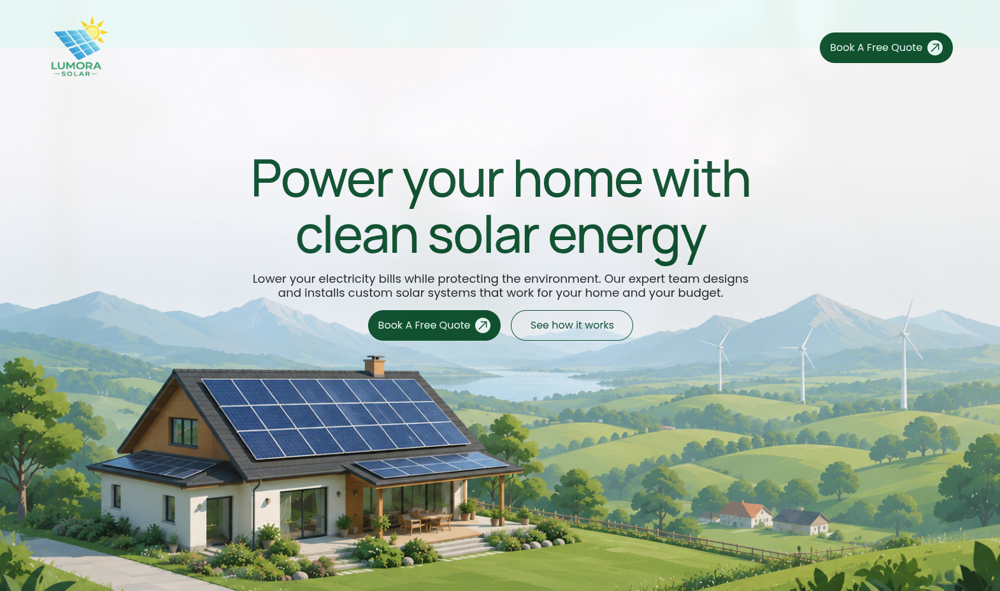
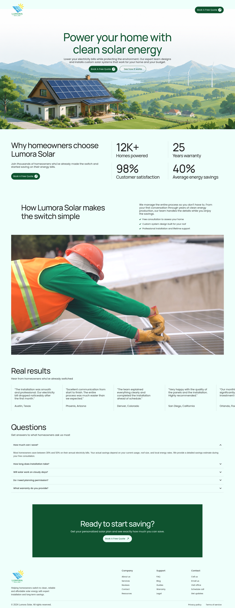

# Lumora Solar – Residential Solar Installation Landing Page

A modern, conversion-focused landing page for **Lumora Solar**, a fictional residential solar installation company. Designed to guide homeowners toward requesting a free consultation through clear messaging, strategic content hierarchy, trust-building elements, and a clean, premium user interface.

**Live Demo:** <https://lumora-solar.byethost33.com/>

## Table of Contents

- [Full Screenshot](#full-screenshot)
- [Features](#features)
- [Project Overview](#project-overview)
- [Installation](#installation)
- [License](#license)

## Full Screenshot

## Features

- **Built with WordPress & Elementor** – Developed entirely using WordPress and Elementor.
- **Smooth scrolling** – Integrated Lenis for a polished scrolling experience.
- **Conversion-focused layout** – Designed around proven landing page principles to maximize quote requests.
- **Modern UI** – Clean typography, generous whitespace, consistent spacing, and a premium visual style.
- **Single-page experience** – A focused landing page with a clear user journey from introduction to conversion.

## Project Overview

Lumora Solar is a fictional company created for this portfolio project. The objective was to design and build a realistic marketing landing page that demonstrates my ability to create modern, conversion-oriented websites using Elementor.

Rather than focusing on advanced functionality, the project emphasizes user experience, visual hierarchy, content structure, and clean interface design. Every section is intentionally placed to build trust, communicate value, address common objections, and guide visitors toward requesting a free consultation.

## Installation

### Option 1 – Local Server (XAMPP / WAMP)

1. Copy the entire project folder into your local server's `htdocs` (XAMPP) or `www` (WAMP) directory.
2. Import the MySQL database:
   - Open phpMyAdmin and create a new database.
   - Import the included `.sql` file into the database.
3. Update the database credentials inside `wp-config.php`.
4. Visit `http://localhost/lumora-solar` in your browser.

### Option 2 – All-in-One WP Migration (`.wpress`)

1. Download the `lumora-solar.wpress` file from the **Releases** page.
2. Install a fresh WordPress instance.
3. Install and activate the **All-in-One WP Migration** plugin.
4. Navigate to **All-in-One WP Migration → Import**.
5. Import the `.wpress` file and confirm the overwrite.
6. Once the import is complete, the website is ready to use.

### Authentication

| Field | Value |
|-------|-------|
| Username | `admin` |
| Email | `admin@mail.com` |
| Password | `admin` |

## License

This project is licensed under the MIT License. See the [LICENSE](LICENSE) file for details.
